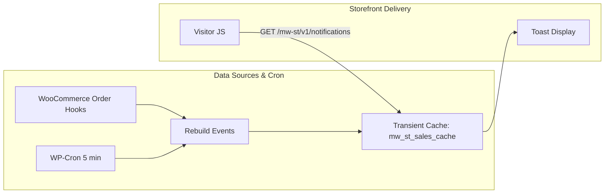

# Merchant Whisper

**Version 1.0.0** — Social proof for WooCommerce: cached real orders, privacy controls, and optional demo fill.

Requires WordPress 5.8+, PHP 7.2+. WooCommerce is required for real orders; demo mode can run without it.

## Features

### Caching & performance
- Real orders loaded with `wc_get_orders()` (HPOS-safe): statuses `processing` + `completed`
- Results stored in transient `mw_st_sales_cache` (≈5 minute TTL)
- WP-Cron every five minutes (`mw_st_update_sales_cache`)
- Debounced rebuild on `woocommerce_new_order`, `woocommerce_order_status_processing`, `woocommerce_order_status_completed`, and payment complete
- **No `wc_get_orders` on normal page views** — only cron, order hooks, or REST cache miss

### REST delivery
- Public endpoint: `GET /wp-json/mw-st/v1/notifications`
- Front end localizes endpoint + display settings only (not the full event list)
- JS fetches on load, cycles toasts, and lightly re-fetches every few minutes while the tab stays open

### Data sources
| Mode | Behavior |
|------|----------|
| Real orders only | Recent consented/eligible orders |
| Demo / simulated only | Configured demo people + catalog products |
| Real then demo (default) | Prefer real orders; fill with demo when few/no sales |

### Privacy / GDPR
- **Require checkout consent** — only show real orders when the customer opted in
- Checkout checkbox (unchecked by default), classic + block checkout
- Order meta: `_mw_st_allow_public` (`yes` / `no`)
- **Hide names** — always use the fallback name (default “Someone”)
- Only first name and city are shown — never email or full address
- Toast delivery and statistics stay on this site (no tracking pixels)
- Admin Support form may POST to Webformatic when you send a message; optional HTTPS webhook (off by default) may send weekly aggregate stats (Slack Incoming Webhooks are the example)

### Message & session controls
- Message template with `{name}`, `{city}`, `{product}`
- Fallback name
- **Multilingual** — optional per-language toast copy (templates, CTA, demo lists) when Polylang, WPML, or TranslatePress is active; product/category ID mapping for Polylang & WPML. Admin UI still uses WordPress `.po` / gettext
- Toasts per visit (`sessionStorage`, no repeats)
- Mute after dismiss via `localStorage` (hours; `0` = dismiss current only)
- Optional disable below 768px viewport width

### Triggers
- **Page load** — first toast after First delay (default; existing stores keep this)
- **Scroll** — after a chosen page-depth percent (short pages count as 100%)
- **Exit intent** — cursor leaving toward the top of the viewport (desktop)
- **Add to cart** — WooCommerce classic AJAX, Blocks store API, or `?add-to-cart=`
- **Inactivity** — no pointer/keyboard/scroll for N seconds
- **Click** — CSS selector; first matching click starts the loop
- Combine any of the above; the first match starts the loop. Duration and gap still apply after that.

### Extra toast types
- **Purchases** — recent orders (default; uncheck to run only extra types)
- **Viewing now** — “X people are viewing {product}”. Simulated uses an admin-set count, or live unique visitors on the product page (session token, no IPs). Simulated can pin specific products; live follows General include/exclude
- **Reviews** — approved WooCommerce product reviews (min stars, excerpt, `{stars}`)
- **CTA / coupon** — promo line, copyable coupon chip, optional button URL; once per session optional
- Types rotate in the same toast loop

### Display & UX
- Corner positions (bottom/top × left/right)
- Timing: first delay, interval, visible duration
- Product thumbnail; image and title link to the product
- Hide on cart & checkout; entire site or shop/products only
- Respect `prefers-reduced-motion`
- Hover pauses hide/loop timers (admin toggle; on by default)
- Dismiss control; `role="status"` / polite live region
- Safe escaping; product link is the only intentional HTML in the line
- Empty REST response → no toast loop

### Demo mode
- Demo people (`Name, City` per line) and relative times
- Products pulled from the published catalog when available
- Labeled clearly in admin; useful for low-traffic stores

### Targeting
- Include / exclude URL paths (wildcards)
- Include / exclude products and categories
- On product pages, optionally show only that product’s sales
- Hide toasts for selected user roles

### Design
- Color, radius, width, shadow, and image-fit controls
- Custom CSS loaded after base toast styles
- **Theme JSON** — export/import design (colors, layout, CSS) for reuse across stores

### Statistics
- Daily totals in a site table (`wp_mw_st_stats`), kept 90 days
- Overview: impressions, clicks, CTR, attributed carts/orders, click→order, attributed revenue
- Daily impressions/clicks chart (Chart.js, bundled) with toggleable carts, orders, dismissals, auto-hides, and revenue
- Breakdowns: toast type (including attributed carts/orders/revenue), real vs demo, page kind, trigger, click target (product vs coupon)
- Completion funnel, skip reasons, dwell averages, per-product table, CSV export
- Collection toggle and 15/30/60/120-minute attribution window (product-link and coupon copy both attribute)
- Counts and product IDs only — no names, emails, IPs, or URLs
- **Webhook digest (optional)** — HTTPS JSON POST on Account; weekly Monday UTC aggregates. Slack Incoming Webhooks are the example. Off by default; URL is site-local and skipped on settings import

### Import / export
- Full settings JSON on Account (newsletter preference and webhook URL stay local)
- Product, category, and URL targeting are **off** in the export unless you check the targeting boxes (those IDs only work on the same store)

## Architecture



## Settings

**WooCommerce → Merchant Whisper** (falls back to **Settings → Merchant Whisper** if WooCommerce is inactive). Capability: `manage_woocommerce` (or `manage_options` without WC).

| Setting | Purpose |
|---------|---------|
| Enable | Show toasts on the front end |
| Position | Corner placement |
| Data source | real / demo / real_then_demo |
| Show on | Entire site or shop/products |
| Hide on cart & checkout | Skip cart/checkout pages |
| Disable on mobile | Hide below 768px |
| Product image | Show thumbnail |
| Reduced motion | Skip when visitor prefers reduced motion |
| Message template | `{name}` `{city}` `{product}` |
| Toast types | Purchases, viewing now, reviews, CTA/coupon |
| Fallback name | Default “Someone” |
| Hide names | Always use fallback name |
| Require checkout consent | Privacy gate for real orders |
| Mute after dismiss (hours) | localStorage mute TTL |
| Timing | Delay / interval / visible for (seconds); pause on hover |
| Triggers | Page load, scroll, exit intent, add to cart, inactivity, click |
| Toasts per visit | Unique toasts in one session (no repeats) |
| Max cached orders | Rebuild query size (keep ≥ toasts per visit) |
| Order lookback (days) | Query window (default 30) |
| Demo people / times | Simulated social proof |
| URL include / exclude | Path rules for where toasts appear |
| Product / category filters | Limit which sales are toasted |
| Product page match | Only that product’s sales on its PDP |
| Custom CSS | Extra toast chrome overrides |
| Theme JSON | Export/import design tokens + custom CSS |
| Statistics | Toast engagement aggregates |
| Webhook / digest | Optional weekly stats JSON POST (Account; Slack as example; off by default) |
| Import / export | Full settings JSON (Account tab) |

## How checkout consent works

1. With **Require checkout consent** enabled, checkout shows an opt-in checkbox.
2. On place order, the choice is saved as `_mw_st_allow_public`.
3. When the sales cache rebuilds, orders without `yes` are skipped if consent is required.
4. With consent off, recent processing/completed orders can appear (subject to other settings).

## Multisite

Each subsite is independent: settings, sales cache, statistics table, crons, and webhook URL are stored per site. Network-activate or activate on individual subsites; new subsites are bootstrapped when the plugin is network-active. Uninstall removes data from every subsite. There is no Network Admin settings screen — configure each store under that site's **Merchant Whisper** menu.

## Installation

1. Place this folder in `wp-content/plugins/mw-sales-toast`.
2. Activate **Merchant Whisper**.
3. Configure **WooCommerce → Merchant Whisper**.
4. Confirm toasts appear after the configured delay when the REST endpoint returns events.

## File structure

```text
mw-sales-toast/
├── mw-sales-toast.php          Bootstrap, constants, activation/deactivation (multisite-aware)
├── uninstall.php               Deletes options, transients, stats table, order meta (all subsites)
├── readme.txt
├── LICENSE
├── README.md
├── assets/
│   ├── toast.js                REST fetch, mute, session cap, hover-pause
│   ├── toast.css
│   └── vendor/                 Chart.js (MIT; see README.txt)
└── includes/
    ├── class-settings.php      Options + admin UI
    ├── class-transfer.php      Settings / theme JSON import-export
    ├── class-cache.php         Rebuild + cron/order hooks
    ├── class-types.php         Viewing / review / CTA events + presence
    ├── class-rest.php          GET mw-st/v1/notifications
    ├── class-analytics.php     Toast engagement aggregates
    ├── class-privacy.php       Checkout consent meta
    ├── class-support.php       Admin contact form
    ├── class-slack.php         Optional HTTPS webhook digest (Slack-compatible JSON)
    └── class-frontend.php      Enqueue + page gates
```

## Keywords / discovery

Terms people may use in **WordPress Admin → Plugins → Add New** or Google:

### WordPress plugin search
- woocommerce social proof
- recent sales
- sales notification
- purchase notification
- sales popup
- fomo
- live sales
- recent purchases
- order notification
- conversion popup
- social proof popup
- woocommerce notification
- sales toast
- customer activity
- who bought

### Google
- woocommerce recent sales notification
- woocommerce social proof plugin
- woocommerce purchase popup
- show recent purchases woocommerce
- someone just bought woocommerce
- woocommerce fomo notification
- woocommerce live sales feed
- recent sales popup wordpress
- woocommerce sales notification plugin
- fake sales notification woocommerce
- demo sales popup woocommerce
- gdpr social proof woocommerce
- privacy friendly sales notification
- woocommerce conversion social proof
- proof / fomo alternative woocommerce

### Primary targets
1. woocommerce social proof
2. recent sales notification
3. purchase notification
4. sales popup
5. fomo

## Changelog

### 1.0.0
- Social proof toasts: recent purchases, viewing now, product reviews, and CTA/coupon
- Cached real orders via WP-Cron and order hooks (HPOS-safe); REST delivery
- Privacy: checkout consent (classic + block), hide names, first-name-and-city only
- Six triggers: page load, scroll, exit intent, add to cart, inactivity, click selector
- Multilingual toast copy for Polylang, WPML, and TranslatePress
- Statistics dashboard: impressions, clicks, CTR, attributed carts/orders/revenue, Chart.js chart, CSV export
- Design controls: colors, radius, width, shadow, image-fit, custom CSS, theme JSON import/export
- Targeting: URL include/exclude, product/category filters, product page match, role hide
- Demo mode with configurable people, times, and catalog products
- Settings import/export, optional HTTPS webhook digest
- Multisite-ready: per-site settings, cache, statistics, and crons
- Full uninstall cleanup across all subsites
